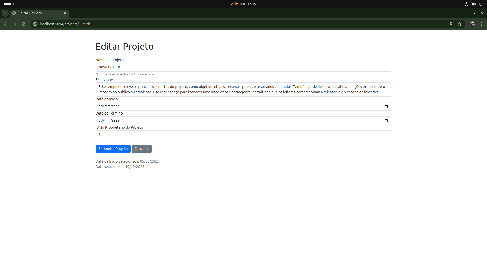
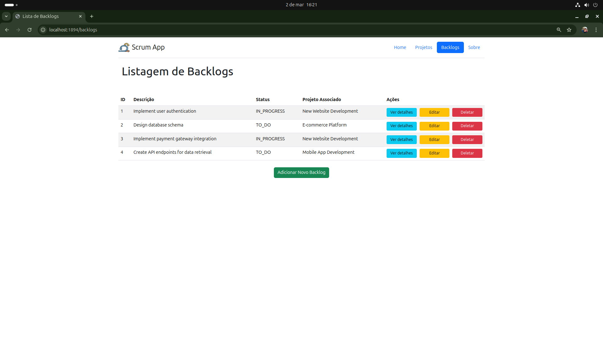
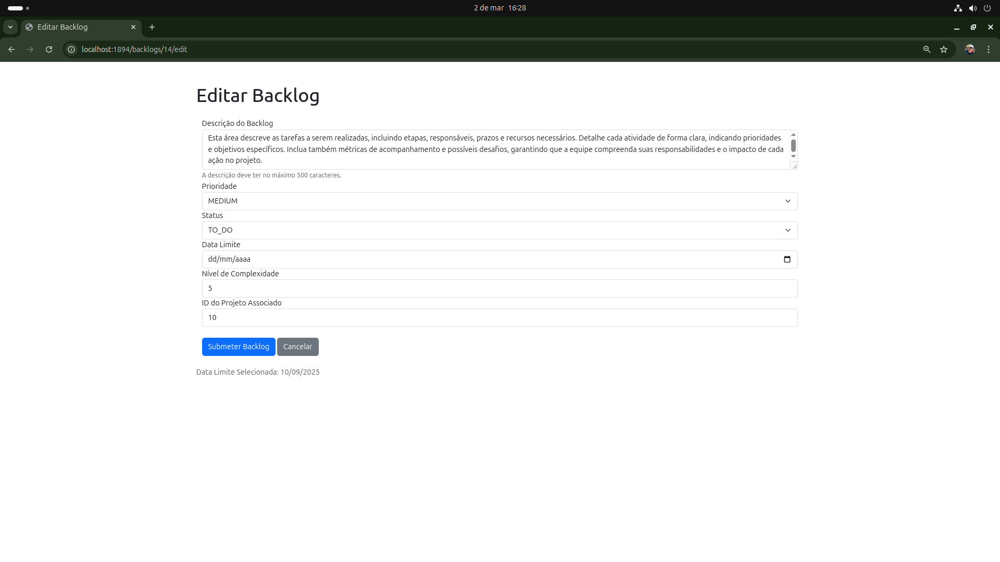

# Scrum Application
Implementação de Scrum em Aplicação Mobile e Web.

## Visão Geral
Este projeto tem como objetivo desenvolver uma aplicação utilizando as melhores práticas de Scrum, com uma abordagem dual de tecnologias: Flutter para o desenvolvimento mobile e Spring para a aplicação web. A metodologia Scrum será adotada para garantir uma entrega ágil, contínua e de alta qualidade, com foco na comunicação eficaz e na colaboração contínua entre as equipes.

## Objetivos do Projeto
- **Desenvolver uma aplicação mobile com Flutter:** Aproveitar a flexibilidade do Flutter para criar uma interface de usuário dinâmica e responsiva, permitindo a execução em múltiplas plataformas (Android e iOS).
- **Construir a aplicação web com Spring:** Utilizar o poder do Spring Framework para desenvolver uma aplicação web robusta e escalável, garantindo segurança e desempenho otimizado.
- **Implementar a metodologia Scrum:** Adotar Scrum para gerenciar o projeto, promovendo entregas incrementais e melhorias contínuas, com uma forte ênfase na colaboração entre as equipes de desenvolvimento mobile e web.

---

## Funcionamento do Projeto

Abaixo estão as principais funcionalidades e páginas da aplicação, com imagens e descrições detalhadas:

### 1. Home Page
A Home Page é a página inicial do sistema, onde os usuários podem visualizar uma visão geral do Scrum Application.

  
*Descrição: A Home Page apresenta uma visão geral do projeto, com cards destacando a visão geral e os objetivos.*

---

### 2. Página de Projetos
A Página de Projetos permite aos usuários visualizar, criar, editar e deletar os projetos cadastrados no sistema.

  
*Descrição: Nesta página, os usuários podem ver uma lista de projetos, com opções para ver detalhes, adicionar, editar ou excluir projetos.*

---

### 3. Página de Adicionar/Editar Projetos
Esta página é utilizada para adicionar novos projetos ou editar projetos existentes. O tratamento de exceções está aplicado para garantir que erros como campos inválidos ou duplicação de dados sejam devidamente tratados, proporcionando uma experiência de usuário mais fluida e informativa.

  
  
  
  
*Descrição: Formulário para adicionar ou editar projetos, com campos como nome, descrição e status. O tratamento de exceções garante que erros sejam exibidos de forma clara e amigável ao usuário.*

---

### 4. Página de Backlogs
A Página de Backlogs exibe os backlogs associados a cada projeto, permitindo a gestão das tarefas e prioridades.

  
*Descrição: Nesta página, os usuários podem ver uma lista de tarefas, com opções para ver detalhes, adicionar, editar ou excluir tarefas.*

---

### 5. Página de Adicionar/Editar Backlogs
Esta página permite aos usuários adicionar novos backlogs ou editar backlogs existentes. O tratamento de exceções está aplicado para garantir que erros como campos inválidos ou duplicação de dados sejam devidamente tratados.

  
  
  

*Descrição: Formulário para adicionar ou editar backlogs, com campos como título, descrição, prioridade e status.*

---

## Como Executar o Projeto
1. **Pré-requisitos:**
    - Java JDK 21 ou superior.
    - Spring Boot 2.x.
    - Flutter SDK (para o desenvolvimento mobile, em andamento).
    - Banco de dados configurado (ex: MySQL, PostgreSQL).

2. **Executando a aplicação web:**
    - Clone o repositório.
    - Configure o arquivo `application.properties` com as credenciais do banco de dados.
    - Execute o projeto Spring Boot.
    - Acesse a aplicação no navegador através de `http://localhost:1894/home`.

3. **Executando a aplicação mobile (em andamento):**
    - Em breve.

---

## Tecnologias Utilizadas
- **Backend:** Spring Boot, Spring Data JPA, Spring Security **(em andamento)**.
- **Frontend (Web):** Thymeleaf, Bootstrap, HTML/CSS/JavaScript.
- **Mobile (em andamento):** Flutter.
- **Banco de Dados:** MySQL/PostgreSQL.
- **Ferramentas de Controle de Versão:** Git, GitHub.
